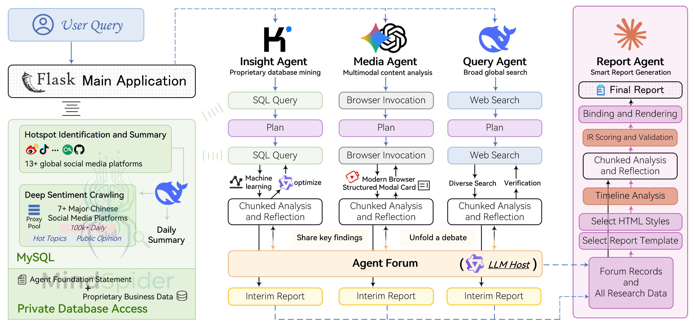

<div align="center">


<a href="https://trendshift.io/repositories/15286" target="_blank"></a>

<a href="https://aihubmix.com/?aff=8Ds9" target="_blank"></a>&ensp;
<a href="https://open.anspire.cn/?share_code=3E1FUOUH" target="_blank"></a>&ensp;
<a href="https://www.thordata.com/?ls=github&lk=EchoLens-Insight" target="_blank"></a>

[](https://github.com/zuohenlin/EchoLens-Insight/stargazers)
[](https://github.com/zuohenlin/EchoLens-Insight/watchers)
[](https://github.com/zuohenlin/EchoLens-Insight/network)
[](https://github.com/zuohenlin/EchoLens-Insight/issues)
[](https://github.com/zuohenlin/EchoLens-Insight/pulls)

[](https://github.com/zuohenlin/EchoLens-Insight/blob/main/LICENSE)
[](https://github.com/zuohenlin/EchoLens-Insight)
[](https://hub.docker.com/)


[English](./README-EN.md) | [中文文档](./README.md)

</div>

> EchoLens Insight (based on BettaFish)

> Note: Online crawling/multi-platform search features are optional and not used in the competition main demo.

> [!IMPORTANT]  
> Check out our newly released prediction engine: [EchoLens - A Simple and Universal Swarm Intelligence Engine for Predicting Everything](https://github.com/666ghj/EchoLens)
> 
> 
>
> The "Data Analysis Three-Step Approach" is now fully connected: We are excited to announce the official release of EchoLens! With the final piece of the puzzle in place, we have built a complete pipeline from EchoLens-Insight (data collection and analysis) to EchoLens (panoramic prediction). The closed loop from raw data to intelligent decision-making is now complete, making it possible to foresee the future!

## ⚡ Project Overview

**EchoLens Insight (based on BettaFish)** is an innovative multi-agent public opinion analysis system built from scratch. It helps break information cocoons, restore the original public sentiment, predict future trends, and assist decision-making. Users only need to raise analysis needs like chatting; the agents automatically analyze 30+ mainstream social platforms at home and abroad and millions of public comments.

> Betta is a small yet combative and beautiful fish, symbolizing "small but powerful, fearless of challenges".

See the system-generated research report on "Wuhan University Public Opinion": [In-depth Analysis Report on Wuhan University's Brand Reputation](./final_reports/final_report__20250827_131630.html)

See a complete system run example on "Wuhan University Public Opinion": [Video - In-depth Analysis Report on Wuhan University's Brand Reputation](https://www.bilibili.com/video/BV1TH1WBxEWN/?vd_source=da3512187e242ce17dceee4c537ec7a6#reply279744466833)

Beyond just report quality, compared to similar products, we have 🚀 six major advantages:

1. **AI-Driven Comprehensive Monitoring**: AI crawler clusters operate 24/7 non-stop, comprehensively covering 10+ key domestic and international social media platforms including Weibo, Xiaohongshu, TikTok, Kuaishou, etc. Not only capturing trending content in real-time, but also drilling down to massive user comments, letting you hear the most authentic and widespread public voice.

2. **Composite Analysis Engine Beyond LLM**: We not only rely on 5 types of professionally designed Agents, but also integrate middleware such as fine-tuned models and statistical models. Through multi-model collaborative work, we ensure the depth, accuracy, and multi-dimensional perspective of analysis results.

3. **Powerful Multimodal Capabilities**: Breaking through text and image limitations, capable of deep analysis of short video content from TikTok, Kuaishou, etc., and precisely extracting structured multimodal information cards such as weather, calendar, stocks from modern search engines, giving you comprehensive control over public opinion dynamics.

4. **Agent "Forum" Collaboration Mechanism**: Endowing different Agents with unique toolsets and thinking patterns, introducing a debate moderator model, conducting chain-of-thought collision and debate through the "forum" mechanism. This not only avoids the thinking limitations of single models and homogenization caused by communication, but also catalyzes higher-quality collective intelligence and decision support.

5. **Seamless Integration of Public and Private Domain Data**: The platform not only analyzes public opinion, but also provides high-security interfaces supporting seamless integration of your internal business databases with public opinion data. Breaking through data barriers, providing powerful analysis capabilities of "external trends + internal insights" for vertical businesses.

6. **Lightweight and Highly Extensible Framework**: Based on pure Python modular design, achieving lightweight, one-click deployment. Clear code structure allows developers to easily integrate custom models and business logic, enabling rapid platform expansion and deep customization.

**Starting with public opinion, but not limited to public opinion**. The goal of "WeiYu" is to become a simple and universal data analysis engine that drives all business scenarios.

> For example, you only need to simply modify the API parameters and prompts of the Agent toolset to transform it into a financial market analysis system.
>
> Here's a relatively active Linux.do project discussion thread: https://linux.do/t/topic/1009280
>
> Check out the comparison by a Linux.do fellow: [Open Source Project (BettaFish) vs manus|minimax|ChatGPT Comparison](https://linux.do/t/topic/1148040)

<div align="center">


Say goodbye to traditional data dashboards. In "WeiYu", everything starts with a simple question - you just need to ask your analysis needs like a conversation
</div>

## 🪄 Sponsors

LLM Model API Sponsor: <a href="https://aihubmix.com/?aff=8Ds9" target="_blank"></a>

<details>
<summary>Provider of core agent capabilities including AI web search, file parsing, and web content scraping: <span style="margin-left: 10px"><a href="https://open.anspire.cn/?share_code=3E1FUOUH" target="_blank"></a></span></summary>
Anspire Open is a leading infrastructure provider for the agent era. We offer developers the core capability stack needed to build powerful agents. Currently available services include AI web search (multiple versions, highly competitive pricing), file parsing (limited-time free), web content scraping (limited-time free), cloud browser automation (Anspire Browser Agent, in beta), multi-turn rewriting, and more. We continue to provide a solid foundation for agents to connect and operate in complex digital worlds. Seamlessly integrates with mainstream agent platforms such as Dify, Coze, and Yuanqi. Through a transparent credit-based billing system and modular design, we provide enterprises with efficient, low-cost customized support to accelerate intelligent transformation.
</details>

<details>
<summary>Claim 1GB free trial, enterprise-grade global proxy IP and Scraper API solution provider, register now: <span style="margin-left: 10px"><a href="https://www.thordata.com/?ls=github&lk=EchoLens-Insight" target="_blank"></a></span></summary>

Thordata helps enterprises easily access publicly available web data through highly reliable proxy networks and automated scraping solutions, with a commitment to 99.9% uptime and 99.7% success rate.
</details>

## 🏗️ System Architecture

### Overall Architecture Diagram

**Insight Agent** Private Database Mining: AI agent for in-depth analysis of private public opinion databases

**Media Agent** Multimodal Content Analysis: AI agent with powerful multimodal capabilities

**Query Agent** Precise Information Search: AI agent with domestic and international web search capabilities

**Report Agent** Intelligent Report Generation: Multi-round report generation AI agent with built-in templates

<div align="center">

</div>

### A Complete Analysis Workflow

| Step | Phase Name                     | Main Operations                                                                                                                  | Participating Components                            | Cycle Nature           |
| ---- | ------------------------------ | -------------------------------------------------------------------------------------------------------------------------------- | --------------------------------------------------- | ---------------------- |
| 1    | User Query                     | Flask main application receives the query                                                                                        | Flask Main Application                              | -                      |
| 2    | Parallel Launch                | Three Agents start working simultaneously                                                                                        | Query Agent, Media Agent, Insight Agent             | -                      |
| 3    | Preliminary Analysis           | Each Agent uses dedicated tools for overview search                                                                              | Each Agent + Dedicated Toolsets                     | -                      |
| 4    | Strategy Formulation           | Develop segmented research strategies based on preliminary results                                                               | Internal Decision Modules of Each Agent             | -                      |
| 5-N  | **Iterative Phase**            | **Forum Collaboration + In-depth Research**                                                                                      | **ForumEngine + All Agents**                        | **Multi-round cycles** |
| 5.1  | In-depth Research              | Each Agent conducts specialized search guided by forum host                                                                      | Each Agent + Reflection Mechanisms + Forum Guidance | Each cycle             |
| 5.2  | Forum Collaboration            | ForumEngine monitors Agent communications and generates host guidance                                                            | ForumEngine + LLM Host                              | Each cycle             |
| 5.3  | Communication Integration      | Each Agent adjusts research directions based on discussions                                                                      | Each Agent + forum_reader tool                      | Each cycle             |
| N+1  | Result Integration             | Report Agent collects all analysis results and forum content                                                                     | Report Agent                                        | -                      |
| N+2  | IR Intermediate Representation | Dynamically select templates and styles, generate metadata through multiple rounds, assemble into IR intermediate representation | Report Agent + Template Engine                      | -                      |
| N+3  | Report Generation              | Perform quality checks on chunks, render into interactive HTML report based on IR                                                | Report Agent + Stitching Engine                     | -                      |

### Project Code Structure Tree

```
EchoLens-Insight/
├── QueryEngine/                            # Domestic and international news breadth search Agent
│   ├── agent.py                            # Agent main logic, coordinates search and analysis workflow
│   ├── llms/                               # LLM interface wrapper
│   ├── nodes/                              # Processing nodes: search, formatting, summarization, etc.
│   ├── tools/                              # Domestic and international news search toolkit
│   ├── utils/                              # Utility functions
│   ├── state/                              # State management
│   ├── prompts/                            # Prompt templates
│   └── ...
├── MediaEngine/                            # Powerful multimodal understanding Agent
│   ├── agent.py                            # Agent main logic, handles video/image multimodal content
│   ├── llms/                               # LLM interface wrapper
│   ├── nodes/                              # Processing nodes: search, formatting, summarization, etc.
│   ├── tools/                              # Multimodal search toolkit
│   ├── utils/                              # Utility functions
│   ├── state/                              # State management
│   ├── prompts/                            # Prompt templates
│   └── ...
├── InsightEngine/                          # Private database mining Agent
│   ├── agent.py                            # Agent main logic, coordinates database queries and analysis
│   ├── llms/                               # LLM interface wrapper
│   │   └── base.py                         # Unified OpenAI-compatible client
│   ├── nodes/                              # Processing nodes: search, formatting, summarization, etc.
│   │   ├── base_node.py                    # Base node class
│   │   ├── search_node.py                  # Search node
│   │   ├── formatting_node.py              # Formatting node
│   │   ├── report_structure_node.py        # Report structure node
│   │   └── summary_node.py                 # Summary node
│   ├── tools/                              # Database query and analysis toolkit
│   │   ├── keyword_optimizer.py            # Qwen keyword optimization middleware
│   │   ├── search.py                       # Database operation toolkit (topic search, comment retrieval, etc.)
│   │   └── sentiment_analyzer.py           # Sentiment analysis integration tool
│   ├── utils/                              # Utility functions
│   │   ├── config.py                       # Configuration management
│   │   ├── db.py                           # SQLAlchemy async engine + read-only query wrapper
│   │   └── text_processing.py              # Text processing utilities
│   ├── state/                              # State management
│   │   └── state.py                        # Agent state definition
│   ├── prompts/                            # Prompt templates
│   │   └── prompts.py                      # Various prompt templates
│   └── __init__.py
├── ReportEngine/                           # Multi-round report generation Agent
│   ├── agent.py                            # Master orchestrator: template selection → layout → budget → chapter → render
│   ├── flask_interface.py                  # Flask/SSE entry point, manages task queuing and streaming events
│   ├── llms/                               # OpenAI-compatible LLM wrappers
│   │   └── base.py                         # Unified streaming/retry client
│   ├── core/                               # Core functionalities: template parsing, chapter storage, document stitching
│   │   ├── template_parser.py              # Markdown template slicer and slug generator
│   │   ├── chapter_storage.py              # Chapter run directory, manifest, and raw stream writer
│   │   └── stitcher.py                     # Document IR stitcher, adds anchors/metadata
│   ├── ir/                                 # Report Intermediate Representation (IR) contract & validation
│   │   ├── schema.py                       # Block/mark schema constant definitions
│   │   └── validator.py                    # Chapter JSON structure validator
│   ├── graphrag/                           # GraphRAG graph building and search
│   │   ├── graph_builder.py                # Build graph from state JSON + forum logs
│   │   ├── graph_storage.py                # Graph object manager and graphrag.json I/O
│   │   ├── query_engine.py                 # Keyword/type/depth query entry
│   │   └── ...                             # Forum/state parsers, prompts, etc.
│   ├── nodes/                              # Full workflow reasoning nodes
│   │   ├── base_node.py                    # Node base class + logging/state hooks
│   │   ├── template_selection_node.py      # Template candidate collection and LLM selection
│   │   ├── document_layout_node.py         # Title/TOC/theme designer
│   │   ├── word_budget_node.py             # Word budget planning and chapter directive generation
│   │   └── chapter_generation_node.py      # Chapter-level JSON generation + validation
│   ├── prompts/                            # Prompt library and schema descriptions
│   │   └── prompts.py                      # Template selection/layout/budget/chapter prompts
│   ├── renderers/                          # IR renderers
│   │   ├── html_renderer.py                # Document IR→interactive HTML
│   │   ├── pdf_renderer.py                 # HTML→PDF export (WeasyPrint)
│   │   ├── pdf_layout_optimizer.py         # PDF layout optimizer
│   │   └── chart_to_svg.py                 # Chart to SVG conversion tool
│   ├── state/                              # Task/metadata state models
│   │   └── state.py                        # ReportState and serialization utilities
│   ├── utils/                              # Configuration and helper utilities
│   │   ├── config.py                       # Pydantic settings + printer helper
│   │   ├── dependency_check.py             # Dependency checking tool
│   │   ├── json_parser.py                  # JSON parsing utilities
│   │   ├── chart_validator.py              # Chart validation tool
│   │   └── chart_repair_api.py             # Chart repair API
│   ├── report_template/                    # Markdown template library
│   │   ├── 企业品牌声誉分析报告.md
│   │   └── ...
│   └── __init__.py
├── ForumEngine/                            # Forum engine: Agent collaboration mechanism
│   ├── monitor.py                          # Log monitoring and forum management core
│   ├── llm_host.py                         # Forum moderator LLM module
│   └── __init__.py
├── MindSpider/                             # Social media crawler system
│   ├── main.py                             # Crawler main program entry
│   ├── config.py                           # Crawler configuration file
│   ├── BroadTopicExtraction/               # Topic extraction module
│   │   ├── main.py                         # Topic extraction main program
│   │   ├── database_manager.py             # Database manager
│   │   ├── get_today_news.py               # Today's news fetcher
│   │   └── topic_extractor.py              # Topic extractor
│   ├── DeepSentimentCrawling/              # Deep sentiment crawling module
│   │   ├── main.py                         # Deep crawling main program
│   │   ├── keyword_manager.py              # Keyword manager
│   │   ├── platform_crawler.py             # Platform crawler manager
│   │   └── MediaCrawler/                   # Media crawler core
│   │       ├── main.py
│   │       ├── config/                     # Platform configurations
│   │       ├── media_platform/             # Platform crawler implementations
│   │       └── ...
│   └── schema/                             # Database schema definitions
│       ├── db_manager.py                   # Database manager
│       ├── init_database.py                # Database initialization script
│       ├── mindspider_tables.sql           # Database table structure SQL
│       ├── models_bigdata.py               # SQLAlchemy mappings for large-scale media opinion tables
│       └── models_sa.py                    # ORM models for DailyTopic/Task extension tables
├── SentimentAnalysisModel/                 # Sentiment analysis model collection
│   ├── WeiboSentiment_Finetuned/           # Fine-tuned BERT/GPT-2 models
│   │   ├── BertChinese-Lora/               # BERT Chinese LoRA fine-tuning
│   │   │   ├── train.py
│   │   │   ├── predict.py
│   │   │   └── ...
│   │   └── GPT2-Lora/                      # GPT-2 LoRA fine-tuning
│   │       ├── train.py
│   │       ├── predict.py
│   │       └── ...
│   ├── WeiboMultilingualSentiment/         # Multilingual sentiment analysis
│   │   ├── train.py
│   │   ├── predict.py
│   │   └── ...
│   ├── WeiboSentiment_SmallQwen/           # Small parameter Qwen3 fine-tuning
│   │   ├── train.py
│   │   ├── predict_universal.py
│   │   └── ...
│   └── WeiboSentiment_MachineLearning/     # Traditional machine learning methods
│       ├── train.py
│       ├── predict.py
│       └── ...
├── SingleEngineApp/                        # Individual Agent Streamlit applications
│   ├── query_engine_streamlit_app.py       # QueryEngine standalone app
│   ├── media_engine_streamlit_app.py       # MediaEngine standalone app
│   └── insight_engine_streamlit_app.py     # InsightEngine standalone app
├── query_engine_streamlit_reports/         # QueryEngine standalone app outputs
├── media_engine_streamlit_reports/         # MediaEngine standalone app outputs
├── insight_engine_streamlit_reports/       # InsightEngine standalone app outputs
├── templates/                              # Flask frontend templates
│   └── index.html                          # Main interface HTML
├── static/                                 # Static resources
│   ├── image/                              # Image resources
│   │   └── ...
│   ├── Partial README for PDF Exporting/   # PDF export dependency setup guide
│   └── v2_report_example/                  # Report rendering examples (archived to /archive)
│       └── report_all_blocks_demo/         # Full block types demo (HTML/PDF/MD)
├── logs/                                   # Runtime log directory
├── final_reports/                          # Final generated report files
│   ├── ir/                                 # Report IR JSON files
│   └── *.html                              # Final HTML reports
├── utils/                                  # Common utility functions
│   ├── forum_reader.py                     # Agent inter-communication forum tool
│   ├── github_issues.py                    # Unified GitHub issue link generator and error formatter
│   └── retry_helper.py                     # Network request retry mechanism utility
├── tests/                                  # Unit tests and integration tests
│   ├── run_tests.py                        # pytest entry script
│   ├── test_monitor.py                     # ForumEngine monitoring unit tests
│   ├── test_report_engine_sanitization.py  # ReportEngine security tests
│   └── ...
├── app.py                                  # Flask main application entry point
├── config.py                               # Global configuration file
├── .env.example                            # Environment variable example file
├── docker-compose.yml                      # Docker multi-service orchestration config
├── Dockerfile                              # Docker image build file
├── requirements.txt                        # Python dependency list
├── regenerate_latest_html.py               # Rebind latest chapters and render HTML
├── regenerate_latest_md.py                 # Rebind latest chapters and render Markdown
├── regenerate_latest_pdf.py                # PDF regeneration utility script
├── report_engine_only.py                   # Report Engine CLI version
├── README.md                               # Chinese documentation
├── README-EN.md                            # English documentation
├── CONTRIBUTING.md                         # Chinese contribution guide
├── CONTRIBUTING-EN.md                      # English contribution guide
└── LICENSE                                 # GPL-2.0 open source license
```

## 🚀 Quick Start (Docker)

### 1. Starting the Project

**Run Command:** Execute the following command to start all services in the **background**:

```bash
docker compose up -d
```

> **Note: Slow image pull speed.** In the original `docker-compose.yml` file, we have provided alternative mirror image addresses as **comments** for you to replace with.

### 2. Configuration Instructions

#### Database Configuration (PostgreSQL)

Configure the database connection information with the following parameters. The system also supports MySQL, so you can adjust the settings as needed:

| Configuration Item | Value to Use     | Description                                                                                       |
| :----------------- | :--------------- | :------------------------------------------------------------------------------------------------ |
| `DB_HOST`          | `db`             | Database service name (as defined in `docker-compose.yml`)                                        |
| `DB_PORT`          | `5432`           | Default PostgreSQL port                                                                           |
| `DB_USER`          | `echolens`       | Database username                                                                                 |
| `DB_PASSWORD`      | `echolens`       | Database password                                                                                 |
| `DB_NAME`          | `echolens`       | Database name                                                                                     |
| **Others**         | **Keep Default** | Please keep other parameters, such as database connection pool settings, at their default values. |

### Large Language Model (LLM) Configuration

All LLM calls use the OpenAI API interface standard. After you finish the database configuration, continue to configure **all LLM-related parameters** so the system can connect to your selected LLM service.

Once you complete and save the configurations above, the system will be ready to run normally.

## 🔧 Source Code Startup Guide

> If you are new to building Agent systems, you can start with a very simple demo: [Deep Search Agent Demo](https://github.com/666ghj/DeepSearchAgent-Demo)

### System Requirements

- **Operating System**: Windows, Linux, MacOS
- **Python Version**: 3.9+
- **Conda**: Anaconda or Miniconda
- **Database**: PostgreSQL (recommended) or MySQL
- **Memory**: 2GB+ recommended

### 1. Create Environment

#### If Using Conda

```bash
# Create conda environment
conda create -n your_conda_name python=3.11
conda activate your_conda_name
```

#### If Using uv

```bash
# Create uv environment
uv venv --python 3.11 # Create Python 3.11 environment
```

### 2. Install System Dependencies for PDF Export (Optional)

This section contains detailed configuration instructions:[Configure the dependencies](./static/Partial%20README%20for%20PDF%20Exporting/README-EN.md)

### 3. Install Dependencies

> If Step 2 is skipped, the WeasyPrint library may not install correctly, and the PDF functionality may be unavailable.

```bash
# Basic dependency installation
pip install -r requirements.txt

# uv version command (faster installation)
uv pip install -r requirements.txt
# If you do not want to use the local sentiment analysis model (which has low computational requirements and defaults to the CPU version), you can comment out the 'Machine Learning' section in this file before executing the command.
```

### 4. Install Playwright Browser Drivers

```bash
# Install browser drivers (for crawler functionality)
playwright install chromium
```

### 5. Configure LLM and Database

Copy the `.env.example` file in the project root directory and rename it to `.env`.

Edit the `.env` file and fill in your API keys (you can also choose your own models and search proxies; see `.env.example` in the project root directory or `config.py` for details):

```yml
# ====================== Database Configuration ======================
# Database host, e.g., localhost or 127.0.0.1
DB_HOST=your_db_host
# Database port number, default is 3306
DB_PORT=3306
# Database username
DB_USER=your_db_user
# Database password
DB_PASSWORD=your_db_password
# Database name
DB_NAME=your_db_name
# Database character set, utf8mb4 is recommended for emoji compatibility
DB_CHARSET=utf8mb4
# Database type: postgresql or mysql
DB_DIALECT=postgresql
# Database initialization is not required, as it will be checked automatically upon executing app.py

# ====================== LLM Configuration ======================
# You can switch each Engine's LLM provider as long as it follows the OpenAI-compatible request format
# The configuration file provides recommended LLMs for each Agent. For initial deployment, please refer to the recommended settings first

# Insight Agent
INSIGHT_ENGINE_API_KEY=
INSIGHT_ENGINE_BASE_URL=
INSIGHT_ENGINE_MODEL_NAME=

# Media Agent
...
```

### 6. Launch System

#### 6.1 Complete System Launch (Recommended)

```bash
# In project root directory, activate conda environment
conda activate your_conda_name

# Start main application
python app.py
```

uv version startup command:
```bash
# In project root directory, activate uv environment
.venv\Scripts\activate

# Start main application
python app.py
```

> Note 1: After a run is terminated, the Streamlit app might not shut down correctly and may still be occupying the port. If this occurs, find the process that is holding the port and kill it.

> Note 2: Data scraping needs to be performed as a separate operation. Please refer to the instructions in section 5.3.

Visit http://localhost:5000 to use the complete system

#### 6.2 Launch Individual Agents

```bash
# Start QueryEngine
streamlit run SingleEngineApp/query_engine_streamlit_app.py --server.port 8503

# Start MediaEngine  
streamlit run SingleEngineApp/media_engine_streamlit_app.py --server.port 8502

# Start InsightEngine
streamlit run SingleEngineApp/insight_engine_streamlit_app.py --server.port 8501
```

#### 6.3 Crawler System Standalone Use

This section has detailed configuration documentation: [MindSpider Usage Guide](./MindSpider/README.md)

<div align="center">


MindSpider Running Example
</div>

```bash
# Enter crawler directory
cd MindSpider

# Project initialization
python main.py --setup

# Run topic extraction (get hot news and keywords)
python main.py --broad-topic

# Run complete crawler workflow
python main.py --complete --date 2024-01-20

# Run topic extraction only
python main.py --broad-topic --date 2024-01-20

# Run deep crawling only
python main.py --deep-sentiment --platforms xhs dy wb
```

#### 6.4 Command-line Report Generation Tool

This tool bypasses the execution phase of all three analysis engines, directly loads their most recent log files, and generates a consolidated report without requiring the Web interface (while also skipping incremental file-validation steps). It will also generate a Markdown copy after the PDF by default (toggle via CLI flag). It is typically used when rapid retries are needed due to unsatisfactory report outputs, or when debugging the Report Engine.

```bash
# Basic usage (automatically extract topic from filename)
python report_engine_only.py

# Specify report topic
python report_engine_only.py --query "Civil Engineering Industry Analysis"

# Skip PDF generation (even if system supports it)
python report_engine_only.py --skip-pdf

# Skip Markdown generation
python report_engine_only.py --skip-markdown

# Show verbose logging
python report_engine_only.py --verbose

# Turn on GraphRAG via CLI and adjust query cap (falls back to .env, default off)
python report_engine_only.py --graphrag-enabled true --graphrag-max-queries 3

# Show help information
python report_engine_only.py --help
```

**Features:**

1. **Automatic Dependency Check**: The program automatically checks system dependencies required for PDF generation and provides installation instructions if missing
2. **Get Latest Files**: Automatically retrieves the latest analysis reports from three engine directories (`insight_engine_streamlit_reports`, `media_engine_streamlit_reports`, `query_engine_streamlit_reports`)
3. **File Confirmation**: Displays all selected file names, paths, and modification times, waiting for user confirmation (default input `y` to continue, input `n` to exit)
4. **Direct Report Generation**: Skips file addition verification and directly calls Report Engine to generate comprehensive reports
5. **Automatic File Saving**:
   - HTML reports saved to `final_reports/` directory
   - PDF reports (if dependencies available) saved to `final_reports/pdf/` directory
   - Markdown reports (disable with `--skip-markdown`) saved to `final_reports/md/` directory
   - File naming format: `final_report_{topic}_{timestamp}.html/pdf/md`
6. **Optional GraphRAG**: CLI flags override `.env`; if neither is set the feature stays off

**Notes:**

- Ensure at least one of the three engine directories contains `.md` report files
- The command-line tool is independent of the Web interface and does not interfere with each other
- PDF generation requires system dependencies, see "Install PDF Export System Dependencies" section above

**Quickly re-render the latest outputs:**

- `regenerate_latest_html.py` / `regenerate_latest_md.py`: Re-stitch the latest chapter JSON from `CHAPTER_OUTPUT_DIR` into a Document IR and render to HTML or Markdown directly.
- `regenerate_latest_pdf.py`: Read the newest IR under `final_reports/ir` and re-export a PDF with SVG vector charts.

## ⚙️ Advanced Configuration (Deprecated: Configuration has been unified to the `.env` file in the project root directory, and other sub-agents automatically inherit the root directory configuration)

### Modify Key Parameters

#### Agent Configuration Parameters

Each agent has dedicated configuration files that can be adjusted according to needs:

```python
# QueryEngine/utils/config.py
class Config:
    max_reflections = 2           # Reflection rounds
    max_search_results = 15       # Maximum search results
    max_content_length = 8000     # Maximum content length
    
# MediaEngine/utils/config.py  
class Config:
    comprehensive_search_limit = 10  # Comprehensive search limit
    web_search_limit = 15           # Web search limit
    
# InsightEngine/utils/config.py
class Config:
    default_search_topic_globally_limit = 200    # Global search limit
    default_get_comments_limit = 500             # Comment retrieval limit
    max_search_results_for_llm = 50              # Max results for LLM
```

#### Sentiment Analysis Model Configuration

```python
# InsightEngine/tools/sentiment_analyzer.py
SENTIMENT_CONFIG = {
    'model_type': 'multilingual',     # Options: 'bert', 'multilingual', 'qwen'
    'confidence_threshold': 0.8,      # Confidence threshold
    'batch_size': 32,                 # Batch size
    'max_sequence_length': 512,       # Max sequence length
}
```

### Integrate Different LLM Models

The system supports any LLM provider that follows the OpenAI request format. You only need to fill in KEY, BASE_URL, and MODEL_NAME in `config.py`.

> What is the OpenAI request format? Here's a simple example:
>```python
>from openai import OpenAI
>
>client = OpenAI(api_key="your_api_key", 
>                base_url="https://aihubmix.com/v1")
>
>response = client.chat.completions.create(
>    model="gpt-4o-mini",
>    messages=[
>        {'role': 'user', 
>         'content': "What new opportunities will reasoning models bring to the market?"}
>    ],
>)
>
>complete_response = response.choices[0].message.content
>print(complete_response)
>```

### Change Sentiment Analysis Models

The system integrates multiple sentiment analysis methods, selectable based on needs:

#### 1. Multilingual Sentiment Analysis

```bash
cd SentimentAnalysisModel/WeiboMultilingualSentiment
python predict.py --text "This product is amazing!" --lang "en"
```

#### 2. Small Parameter Qwen3 Fine-tuning

```bash
cd SentimentAnalysisModel/WeiboSentiment_SmallQwen
python predict_universal.py --text "This event was very successful"
```

#### 3. BERT-based Fine-tuned Model

```bash
# Use BERT Chinese model
cd SentimentAnalysisModel/WeiboSentiment_Finetuned/BertChinese-Lora
python predict.py --text "This product is really great"
```

#### 4. GPT-2 LoRA Fine-tuned Model

```bash
cd SentimentAnalysisModel/WeiboSentiment_Finetuned/GPT2-Lora
python predict.py --text "I'm not feeling great today"
```

#### 5. Traditional Machine Learning Methods

```bash
cd SentimentAnalysisModel/WeiboSentiment_MachineLearning
python predict.py --model_type "svm" --text "Service attitude needs improvement"
```

### Integrate Custom Business Database

#### 1. Modify Database Connection Configuration

```python
# Add your business database configuration in config.py
BUSINESS_DB_HOST = "your_business_db_host"
BUSINESS_DB_PORT = 3306
BUSINESS_DB_USER = "your_business_user"
BUSINESS_DB_PASSWORD = "your_business_password"
BUSINESS_DB_NAME = "your_business_database"
```

#### 2. Create Custom Data Access Tools

```python
# InsightEngine/tools/custom_db_tool.py
class CustomBusinessDBTool:
    """Custom business database query tool"""
    
    def __init__(self):
        self.connection_config = {
            'host': config.BUSINESS_DB_HOST,
            'port': config.BUSINESS_DB_PORT,
            'user': config.BUSINESS_DB_USER,
            'password': config.BUSINESS_DB_PASSWORD,
            'database': config.BUSINESS_DB_NAME,
        }
    
    def search_business_data(self, query: str, table: str):
        """Query business data"""
        # Implement your business logic
        pass
    
    def get_customer_feedback(self, product_id: str):
        """Get customer feedback data"""
        # Implement customer feedback query logic
        pass
```

#### 3. Integrate into InsightEngine

```python
# Integrate custom tools in InsightEngine/agent.py
from .tools.custom_db_tool import CustomBusinessDBTool

class DeepSearchAgent:
    def __init__(self, config=None):
        # ... other initialization code
        self.custom_db_tool = CustomBusinessDBTool()
    
    def execute_custom_search(self, query: str):
        """Execute custom business data search"""
        return self.custom_db_tool.search_business_data(query, "your_table")
```

### Custom Report Templates

#### 1. Upload in Web Interface

The system supports uploading custom template files (.md or .txt format), selectable when generating reports.

#### 2. Create Template Files

Create new templates in the `ReportEngine/report_template/` directory, and our Agent will automatically select the most appropriate template.

## 🤝 Contributing Guide

We welcome all forms of contributions!

**Please read the following contribution guidelines:**  
- [CONTRIBUTING-EN.md](./CONTRIBUTING-EN.md)

## 🦖 Next Development Plan

The system has now completed the final prediction step! Visit 【EchoLens - Predict Everything】: https://github.com/666ghj/EchoLens

<div align="center">


</div>

## ⚠️ Disclaimer

**Important Notice: This project is for educational, academic research, and learning purposes only**

1. **Compliance Statement**:
   - All code, tools, and functionalities in this project are intended solely for educational, academic research, and learning purposes
   - Commercial use or profit-making activities are strictly prohibited
   - Any illegal, non-compliant, or rights-infringing activities are strictly prohibited

2. **Web Scraping Disclaimer**:
   - The web scraping functionality in this project is intended only for technical learning and research purposes
   - Users must comply with the target websites' robots.txt protocols and terms of use
   - Users must comply with relevant laws and regulations and must not engage in malicious scraping or data abuse
   - Users are solely responsible for any legal consequences arising from the use of web scraping functionality

3. **Data Usage Disclaimer**:
   - The data analysis functionality in this project is intended only for academic research purposes
   - Using analysis results for commercial decision-making or profit-making purposes is strictly prohibited
   - Users should ensure the legality and compliance of the data being analyzed

4. **Technical Disclaimer**:
   - This project is provided "as is" without any express or implied warranties
   - The authors are not responsible for any direct or indirect losses caused by the use of this project
   - Users should evaluate the applicability and risks of this project independently

5. **Liability Limitation**:
   - Users should fully understand relevant laws and regulations before using this project
   - Users should ensure their usage complies with local legal and regulatory requirements
   - Users are solely responsible for any consequences arising from the illegal use of this project

**Please carefully read and understand the above disclaimer before using this project. Using this project indicates that you have agreed to and accepted all the above terms.**

## 📄 License

This project is licensed under the [GPL-2.0 License](LICENSE). Please see the LICENSE file for details.

## 🎉 Support & Contact

### Get Help

  FAQ: https://github.com/zuohenlin/EchoLens-Insight/issues/185

- **Project Homepage**: [GitHub Repository](https://github.com/zuohenlin/EchoLens-Insight)
- **Issue Reporting**: [Issues Page](https://github.com/zuohenlin/EchoLens-Insight/issues)
- **Feature Requests**: [Discussions Page](https://github.com/zuohenlin/EchoLens-Insight/discussions)

### Contact Information

- 📧 **Email**: hangjiang@bupt.edu.cn

### Business Cooperation

- **Enterprise Custom Development**
- **Big Data Services**
- **Academic Collaboration**
- **Technical Training**

## 👥 Contributors

Thanks to these excellent contributors:

[](https://github.com/zuohenlin/EchoLens-Insight/graphs/contributors)

## 🌟 Join Our Official Community

<div align="center">
  
  
</div>

## 📈 Project Statistics

<a href="https://www.star-history.com/#zuohenlin/EchoLens-Insight&type=date&legend=top-left">
 <picture>
   <source media="(prefers-color-scheme: dark)" srcset="https://api.star-history.com/svg?repos=zuohenlin/EchoLens-Insight&type=date&theme=dark&legend=top-left" />
   <source media="(prefers-color-scheme: light)" srcset="https://api.star-history.com/svg?repos=zuohenlin/EchoLens-Insight&type=date&legend=top-left" />
   
 </picture>
</a>


